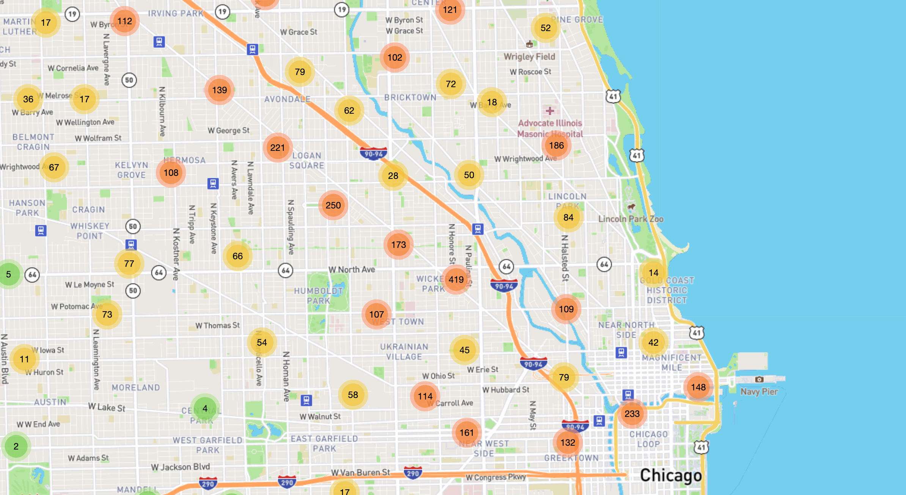
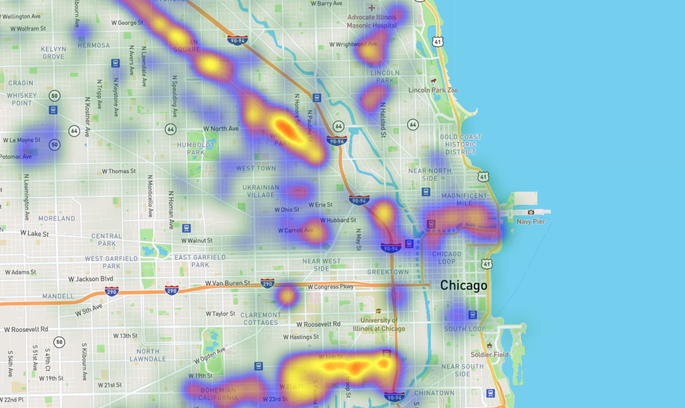

# graffiti-removal
## Team: “Word on the Street”
Team Members: 
    Katie Young,
    Liliana Ilut,
    Vasil Nenov,
    Quentin Sloboda.

## Background

Each day someone in Chicago makes a call to 311 to report a graffiti that needs to be removed. The City of Chicago is doing a very good job to keep track of these graffiti and to removed them, some in a manner of days. Our project explores the data from 311 Service Requests - Graffiti Removal. The data set included with the assignment is fond here : https://data.cityofchicago.org/Service-Requests/311-Service-Requests-Graffiti-Removal-Historical/hec5-y4x5/data.
The goal of this project is to explore the data, observe trends, tell a story through data visualization.

### Requirements
1. Our visualization includes a Python Flask–powered RESTful API, HTML/CSS, JavaScript, and SQL database.
2. Our project contains:

### 2.1. A dinamic line graph that displays the number and the date of graffiti removal requests. This graph was created using D3.js library.
        

### 2.2. An interactive table that filters the graffiti based on your zipcode;
        

### 2.3.One Cluster Map that was created using Leaflet library;
        

### 2.4.One Heat Map that was created using Leaflet library
        
        
        
3. The Dasboard page contains a Navigation Bar with buttons for all the maps, table, chart and the API data.
4. Our project includes CircleType.js -- a new Java Script library that allowed us to curve the title from the home page.

